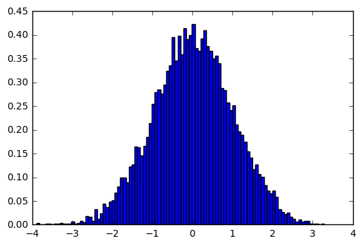
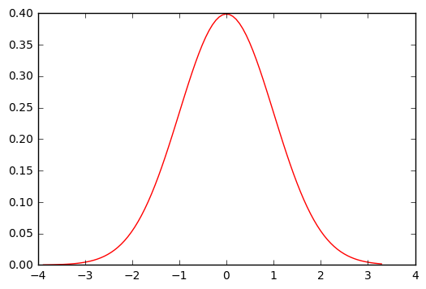
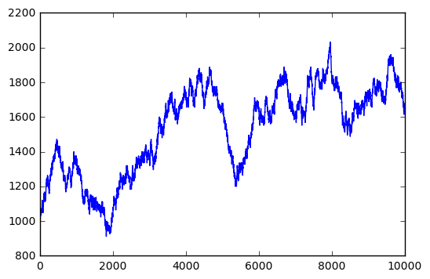
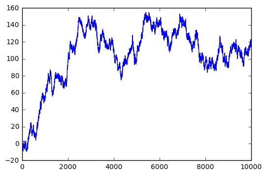

下面将从这5个方面来介绍numpy模块的内容：

1. 数组的创建
2. 有关数组的属性和函数
3. 数组元素的获取--普通索引、切片、布尔索引和花式索引
4. 统计函数与线性代数运算
5. 随机数的生成

## 一、数组的创建

numpy中使用array()函数创建数组,**array的首个参数一定是一个序列，可以是元组也可以是列表**。

### 一维数组的创建

可以使用numpy中的arange()函数创建一维有序数组，它是内置函数range的扩展版。


```python
import numpy as np
```


```python
ls1 = range(10)
```


```python
list(ls1)
```


    [0, 1, 2, 3, 4, 5, 6, 7, 8, 9]


```python
type(ls1)
```


    list


```python
ls2 = np.arange(10)
```


```python
list(ls2)
```


    [0, 1, 2, 3, 4, 5, 6, 7, 8, 9]


```python
type(ls2)
```


    numpy.ndarray


通过arange生成的序列就不是简简单单的列表类型了，而是一个一维数组。

如果一维数组不是一个规律的有序元素，而是人为的输入，就需要array()函数创建了。


```python
arr1 = np.array((1,20,13,28,22))
```


```python
arr1
```


    array([ 1, 20, 13, 28, 22])


```python
type(arr1)
```


    numpy.ndarray


上面是由**元组**序列构成的一维数组。


```python
arr2 = np.array([1,1,2,3,5,8,13,21])
```


```python
arr2
```


    array([ 1,  1,  2,  3,  5,  8, 13, 21])


```python
type(arr2)
```


    numpy.ndarray


上面是由**列表**序列构成的一维数组。

### 二维数组的创建

二维数组的创建，其实在就是**列表套列表**或**元组套元组**。


```python
arr3 = np.array(((1,1,2,3),(5,8,13,21),(34,55,89,144)))
```


```python
arr3
```


    array([[  1,   1,   2,   3],
           [  5,   8,  13,  21],
           [ 34,  55,  89, 144]])


上面使用**元祖套元祖**的方式。


```python
arr4 = np.array([[1,2,3,4],[5,6,7,8],[9,10,11,12]])
```


```python
arr4
```


    array([[ 1,  2,  3,  4],
           [ 5,  6,  7,  8],
           [ 9, 10, 11, 12]])


上面使用**列表套列表**的方式。

对于**高维数组**在将来的数据分析中用的比较少，这里关于高维数组的创建就不赘述了，构建方法仍然是套的方式。

上面所介绍的都是人为设定的一维、二维或高维数组，numpy中也提供了几种特殊的数组，它们是：


```python
np.ones(3) #返回一维元素全为1的数组
```


    array([ 1.,  1.,  1.])


```python
np.ones([3,4]) #返回元素全为1的3*4二维数组
```


    array([[ 1.,  1.,  1.,  1.],
           [ 1.,  1.,  1.,  1.],
           [ 1.,  1.,  1.,  1.]])


```python
np.zeros(3) #返回一维元素全为0的数组
```


    array([ 0.,  0.,  0.])


```python
np.zeros([3,4]) #返回元素全为0的3*4二维数组
```


    array([[ 0.,  0.,  0.,  0.],
           [ 0.,  0.,  0.,  0.],
           [ 0.,  0.,  0.,  0.]])


```python
np.empty(3) #返回一维空数组
```


    array([ 0.,  0.,  0.])


```python
np.empty([3,4]) #返回3×4二维空数组
```


    array([[ 0.,  0.,  0.,  0.],
           [ 0.,  0.,  0.,  0.],
           [ 0.,  0.,  0.,  0.]])


## 二、有关数组的属性和函数

当一个数组构建好后，我们看看关于数组本身的操作又有哪些属性和函数：


```python
arr3
```


    array([[  1,   1,   2,   3],
           [  5,   8,  13,  21],
           [ 34,  55,  89, 144]])


```python
arr3.shape #shape方法返回数组的行数和列数
```


    (3L, 4L)


```python
arr3.dtype  #dtype方法返回数组的数据类型
```


    dtype('int32')


```python
a = arr3.ravel()    #通过ravel的方法将数组拉直（多维数组降为一维数组）
```


```python
a
```


    array([  1,   1,   2,   3,   5,   8,  13,  21,  34,  55,  89, 144])


```python
b = arr3.flatten()  #通过flatten的方法将数组拉直
```


```python
b
```


    array([  1,   1,   2,   3,   5,   8,  13,  21,  34,  55,  89, 144])


两者的区别在于**ravel方法**生成的是原数组的**视图**，无需占有内存空间，**但试图的改变会影响到原数组的变化**。而**flatten方法**返回的是**真实值**，其值的改变并不会影响原数组的更改。

通过下面的例子也许就能明白了：


```python
b[:3] = 0
```


```python
arr3
```


    array([[  1,   1,   2,   3],
           [  5,   8,  13,  21],
           [ 34,  55,  89, 144]])


通过更改b的值，原数组没有变化。


```python
a[:3] = 0
```


```python
arr3
```


    array([[  0,   0,   0,   3],
           [  5,   8,  13,  21],
           [ 34,  55,  89, 144]])


a的值变化后，会导致原数组跟着变化。


```python
arr4
```


    array([[ 1,  2,  3,  4],
           [ 5,  6,  7,  8],
           [ 9, 10, 11, 12]])


```python
arr4.ndim #返回数组的纬数
```


    2


```python
arr4.size #返回数组元素的个数
```


    12


```python
arr4.T #返回数组的转置结果
```


    array([[ 1,  5,  9],
           [ 2,  6, 10],
           [ 3,  7, 11],
           [ 4,  8, 12]])


**如果数组的数据类型为复数的话**，real方法可以返回复数的实部，imag方法返回复数的虚部。

介绍完数组的一些方法后，接下来我们看看数组自身有哪些**函数**可操作：


```python
len(arr4) #返回数组有多少行
```


    3


```python
arr3
```


    array([[  0,   0,   0,   3],
           [  5,   8,  13,  21],
           [ 34,  55,  89, 144]])


```python
arr4
```


    array([[ 1,  2,  3,  4],
           [ 5,  6,  7,  8],
           [ 9, 10, 11, 12]])


```python
np.hstack((arr3,arr4))
```


    array([[  0,   0,   0,   3,   1,   2,   3,   4],
           [  5,   8,  13,  21,   5,   6,   7,   8],
           [ 34,  55,  89, 144,   9,  10,  11,  12]])


**横向拼接**arr3和arr4两个数组，但必须满足两个数组的行数相同。


```python
np.vstack((arr3,arr4))
```


    array([[  0,   0,   0,   3],
           [  5,   8,  13,  21],
           [ 34,  55,  89, 144],
           [  1,   2,   3,   4],
           [  5,   6,   7,   8],
           [  9,  10,  11,  12]])


**纵向拼接**arr3和arr4两个数组，但必须满足两个数组的列数相同。


```python
np.column_stack((arr3,arr4))    #与hstack函数具有一样的效果
```


    array([[  0,   0,   0,   3,   1,   2,   3,   4],
           [  5,   8,  13,  21,   5,   6,   7,   8],
           [ 34,  55,  89, 144,   9,  10,  11,  12]])


```python
np.row_stack((arr3,arr4))
```


    array([[  0,   0,   0,   3],
           [  5,   8,  13,  21],
           [ 34,  55,  89, 144],
           [  1,   2,   3,   4],
           [  5,   6,   7,   8],
           [  9,  10,  11,  12]])


reshape()函数和resize()函数可以重新设置数组的行数和列数：


```python
arr5 = np.array(np.arange(24))
```


```python
arr5 #此为一维数组
```


    array([ 0,  1,  2,  3,  4,  5,  6,  7,  8,  9, 10, 11, 12, 13, 14, 15, 16,
           17, 18, 19, 20, 21, 22, 23])


```python
a = arr5.reshape(4,6)
```


```python
a
```


    array([[ 0,  1,  2,  3,  4,  5],
           [ 6,  7,  8,  9, 10, 11],
           [12, 13, 14, 15, 16, 17],
           [18, 19, 20, 21, 22, 23]])


通过**reshape函数**将一维数组设置为二维数组，且为4行6列的数组。


```python
a.resize(6,4)
```


```python
a
```


    array([[ 0,  1,  2,  3],
           [ 4,  5,  6,  7],
           [ 8,  9, 10, 11],
           [12, 13, 14, 15],
           [16, 17, 18, 19],
           [20, 21, 22, 23]])


通过**resize函数**会直接改变原数组的形状。

数组转换：**tolist将数组转换为列表，astype()强制转换数组的数据类型**，下面是两个函数的例子：


```python
b = a.tolist()
```


```python
b
```


    [[0, 1, 2, 3],
     [4, 5, 6, 7],
     [8, 9, 10, 11],
     [12, 13, 14, 15],
     [16, 17, 18, 19],
     [20, 21, 22, 23]]


```python
type(b)
```


    list


```python
c = a.astype(float)
```


```python
c
```


    array([[  0.,   1.,   2.,   3.],
           [  4.,   5.,   6.,   7.],
           [  8.,   9.,  10.,  11.],
           [ 12.,  13.,  14.,  15.],
           [ 16.,  17.,  18.,  19.],
           [ 20.,  21.,  22.,  23.]])


```python
a.dtype
```


    dtype('int32')


```python
c.dtype
```


    dtype('float64')


## 三、数组元素的获取

### 一位数组元素的获取

通过索引和切片的方式获取数组元素，**一维数组元素的获取**与列表、元组的获取方式一样：


```python
arr7 = np.array(np.arange(10))
```


```python
arr7
```


    array([0, 1, 2, 3, 4, 5, 6, 7, 8, 9])


```python
arr7[3] #获取第4个元素
```


    3


```python
arr7[:3] #获取前3个元素
```


    array([0, 1, 2])


```python
arr7[3:] #获取第4个元素以及之后的所有元素
```


    array([3, 4, 5, 6, 7, 8, 9])


```python
arr7[-2:] #获取末尾的2个元素
```


    array([8, 9])


```python
arr7[::2] #从第1个元素开始，获取步长为2的所有元素
```


    array([0, 2, 4, 6, 8])


### 二维数组元素的获取


```python
arr8 = np.array(np.arange(12)).reshape(3,4)
```


```python
arr8
```


    array([[ 0,  1,  2,  3],
           [ 4,  5,  6,  7],
           [ 8,  9, 10, 11]])


```python
arr8[1] #返回数组的第2行
```


    array([4, 5, 6, 7])


```python
arr8[:2] #返回数组的前2行
```


    array([[0, 1, 2, 3],
           [4, 5, 6, 7]])


```python
arr8[[0,2]] #返回指定的第1行和第3行
```


    array([[ 0,  1,  2,  3],
           [ 8,  9, 10, 11]])


```python
arr8[:,0] #返回数组的第1列
```


    array([0, 4, 8])


```python
arr8[:,-2:] #返回数组的后2列
```


    array([[ 2,  3],
           [ 6,  7],
           [10, 11]])


```python
arr8[:,[0,2]] #返回数组的第1列和第3列
```


    array([[ 0,  2],
           [ 4,  6],
           [ 8, 10]])


```python
arr8[1,2] #返回数组中第2行第3列对应的元素
```


    6


**布尔索引**，即索引值为True和False，需要注意的是布尔索引必须输数组对象。


```python
log = np.array([True,False,False,True,True,False])
```


```python
arr9 = np.array(np.arange(24)).reshape(6,4)
```


```python
arr9
```


    array([[ 0,  1,  2,  3],
           [ 4,  5,  6,  7],
           [ 8,  9, 10, 11],
           [12, 13, 14, 15],
           [16, 17, 18, 19],
           [20, 21, 22, 23]])


```python
arr9[log] #返回所有为True的对应行
```


    array([[ 0,  1,  2,  3],
           [12, 13, 14, 15],
           [16, 17, 18, 19]])


```python
arr9[~log] #通过~号筛选出所有为False的对应行
```


    array([[ 4,  5,  6,  7],
           [ 8,  9, 10, 11],
           [20, 21, 22, 23]])


举一个场景，一维数组表示区域，二维数组表示观测值，如何选取目标区域的观测？


```python
area = np.array(['A','B','A','C','A','B','D'])
```


```python
area
```


    array(['A', 'B', 'A', 'C', 'A', 'B', 'D'], 
          dtype='|S1')


```python
observes = np.array(np.arange(21)).reshape(7,3)
```


```python
observes
```


    array([[ 0,  1,  2],
           [ 3,  4,  5],
           [ 6,  7,  8],
           [ 9, 10, 11],
           [12, 13, 14],
           [15, 16, 17],
           [18, 19, 20]])


```python
observes[area == 'A'] #返回所有A区域的观测。
```


    array([[ 0,  1,  2],
           [ 6,  7,  8],
           [12, 13, 14]])


```python
observes[(area == 'A') | (area == 'D')] #返回所有A区域和D区域的观测。
```


    array([[ 0,  1,  2],
           [ 6,  7,  8],
           [12, 13, 14],
           [18, 19, 20]])


当然，布尔索引也可以与普通索引或切片混合使用：


```python
observes[area == 'A'][:,[0,2]]
```


    array([[ 0,  2],
           [ 6,  8],
           [12, 14]])


返回A区域的所有行，且只获取第1列与第3列数据。

**花式索引**：实际上就是将数组作为索引将原数组的元素提取出来


```python
arr10 = np.arange(1,29).reshape(7,4)
```


```python
arr10
```


    array([[ 1,  2,  3,  4],
           [ 5,  6,  7,  8],
           [ 9, 10, 11, 12],
           [13, 14, 15, 16],
           [17, 18, 19, 20],
           [21, 22, 23, 24],
           [25, 26, 27, 28]])


```python
arr10[[4,1,3,5]] #按照指定顺序返回指定行
```


    array([[17, 18, 19, 20],
           [ 5,  6,  7,  8],
           [13, 14, 15, 16],
           [21, 22, 23, 24]])


```python
arr10[[4,1,5]][:,[0,2,3]] #返回指定的行与列
```


    array([[17, 19, 20],
           [ 5,  7,  8],
           [21, 23, 24]])


```python
 arr10[[4,1,5],[0,2,3]]
```


    array([17,  7, 24])


**请注意！**这与上面的返回结果是截然不同的，上面返回的是二维数组，而这条命令返回的是一维数组。

如果想使用比较简单的方式返回指定行以列的二维数组的话，可以**使用ix_()函数**


```python
arr10[np.ix_([4,1,5],[0,2,3])]
```


    array([[17, 19, 20],
           [ 5,  7,  8],
           [21, 23, 24]])


这与arr10[[4,1,5]][:,[0,2,3]]返回的结果是一致的。

## 四、统计函数与线性代数运算

统计运算中常见的聚合函数有：最小值、最大值、中位数、均值、方差、标准差等。

### 数组元素级别的计算


```python
arr11 = 5-np.arange(1,13).reshape(4,3)
```


```python
arr12 = np.random.randint(1,10,size = 12).reshape(4,3)
```


```python
arr11
```


    array([[ 4,  3,  2],
           [ 1,  0, -1],
           [-2, -3, -4],
           [-5, -6, -7]])


```python
arr12
```


    array([[7, 9, 6],
           [3, 6, 5],
           [4, 9, 4],
           [8, 4, 8]])


```python
arr11 ** 2 #计算每个元素的平方
```


    array([[16,  9,  4],
           [ 1,  0,  1],
           [ 4,  9, 16],
           [25, 36, 49]])


```python
np.sqrt(arr11) #计算每个元素的平方根
```

    C:\Users\Lenovo\Anaconda2\lib\site-packages\ipykernel\__main__.py:1: RuntimeWarning: invalid value encountered in sqrt
      if __name__ == '__main__':
    


    array([[ 2.        ,  1.73205081,  1.41421356],
           [ 1.        ,  0.        ,         nan],
           [        nan,         nan,         nan],
           [        nan,         nan,         nan]])


由于**负值的平方根**没有意义，故**返回nan**。


```python
np.exp(arr11) #计算每个元素的指数值
```


    array([[  5.45981500e+01,   2.00855369e+01,   7.38905610e+00],
           [  2.71828183e+00,   1.00000000e+00,   3.67879441e-01],
           [  1.35335283e-01,   4.97870684e-02,   1.83156389e-02],
           [  6.73794700e-03,   2.47875218e-03,   9.11881966e-04]])


```python
np.log(arr12) #计算每个元素的自然对数值
```


    array([[ 1.94591015,  2.19722458,  1.79175947],
           [ 1.09861229,  1.79175947,  1.60943791],
           [ 1.38629436,  2.19722458,  1.38629436],
           [ 2.07944154,  1.38629436,  2.07944154]])


```python
np.abs(arr11) #计算每个元素的绝对值
```


    array([[4, 3, 2],
           [1, 0, 1],
           [2, 3, 4],
           [5, 6, 7]])


### 相同形状数组间元素的操作


```python
arr11 + arr12 #加
```


    array([[11, 12,  8],
           [ 4,  6,  4],
           [ 2,  6,  0],
           [ 3, -2,  1]])


```python
arr11 - arr12 #减
```


    array([[ -3,  -6,  -4],
           [ -2,  -6,  -6],
           [ -6, -12,  -8],
           [-13, -10, -15]])


```python
arr11 * arr12 #乘
```


    array([[ 28,  27,  12],
           [  3,   0,  -5],
           [ -8, -27, -16],
           [-40, -24, -56]])


```python
arr11 / arr12 #除
```


    array([[ 0,  0,  0],
           [ 0,  0, -1],
           [-1, -1, -1],
           [-1, -2, -1]])


```python
arr11 // arr12 #整除
```


    array([[ 0,  0,  0],
           [ 0,  0, -1],
           [-1, -1, -1],
           [-1, -2, -1]])


```python
arr11 % arr12 #取余
```


    array([[4, 3, 2],
           [1, 0, 4],
           [2, 6, 0],
           [3, 2, 1]])


### 统计运算函数


```python
np.sum(arr11) #计算所有元素的和
```


    -18


```python
np.sum(arr11,axis = 0) #对每一列求和
```


    array([ -2,  -6, -10])


```python
np.sum(arr11, axis = 1) #对每一行求和
```


    array([  9,   0,  -9, -18])


```python
np.cumsum(arr11) #对每一个元素求累积和（从上到下，从左到右的元素顺序）
```


    array([  4,   7,   9,  10,  10,   9,   7,   4,   0,  -5, -11, -18])


```python
np.cumsum(arr11, axis = 0) #计算每一列的累积和，并返回二维数组
```


    array([[  4,   3,   2],
           [  5,   3,   1],
           [  3,   0,  -3],
           [ -2,  -6, -10]])


```python
np.cumprod(arr11, axis = 1) #计算每一行的累计积，并返回二维数组
```


    array([[   4,   12,   24],
           [   1,    0,    0],
           [  -2,    6,  -24],
           [  -5,   30, -210]])


```python
np.min(arr11) #计算所有元素的最小值
```


    -7


```python
np.max(arr11, axis = 0) #计算每一列的最大值
```


    array([4, 3, 2])


```python
np.mean(arr11) #计算所有元素的均值
```


    -1.5


```python
np.mean(arr11, axis = 1) #计算每一行的均值
```


    array([ 3.,  0., -3., -6.])


```python
np.median(arr11) #计算所有元素的中位数
```


    -1.5


```python
np.median(arr11, axis = 0) #计算每一列的中位数
```


    array([-0.5, -1.5, -2.5])


```python
np.var(arr12) #计算所有元素的方差
```


    4.0763888888888902


```python
np.std(arr12, axis = 1) #计算每一行的标准差
```


    array([ 1.24721913,  1.24721913,  2.3570226 ,  1.88561808])


numpy中的统计函数运算是非常灵活的，既可以计算所有元素的统计值，也可以计算指定行或列的统计指标。还有**其他常用的函数**，如符号函数sign，ceil(>=x的最小整数)，floor(<=x的最大整数)，modf(将浮点数的整数部分与小数部分分别存入两个独立的数组)，cos，arccos，sin，arcsin，tan，arctan等。

让我很兴奋的一个函数是**where()**，它类似于Excel中的if函数，可以进行灵活的变换：


```python
arr11
```


    array([[ 4,  3,  2],
           [ 1,  0, -1],
           [-2, -3, -4],
           [-5, -6, -7]])


```python
np.where(arr11 < 0, 'negtive','positive')
```


    array([['positive', 'positive', 'positive'],
           ['positive', 'positive', 'negtive'],
           ['negtive', 'negtive', 'negtive'],
           ['negtive', 'negtive', 'negtive']], 
          dtype='|S8')


当然，np.where还可以**嵌套使用**，完成复杂的运算。

**其它函数**

unique(x):计算x的唯一元素，并返回有序结果

intersect(x,y)：计算x和y的公共元素，即交集

union1d(x,y):计算x和y的并集

setdiff1d(x,y):计算x和y的差集，即元素在x中，不在y中

setxor1d(x,y):计算集合的对称差，即存在于一个数组中，但不同时存在于两个数组中

in1d(x,y):判断x的元素是否包含于y中

### 线性代数运算

同样numpy也跟R语言一样，可以非常方便的进行线性代数方面的计算，如行列式、逆、迹、特征根、特征向量等。但需要注意的是，有关线性代数的函数并不在numpy中，而是**numpy的子例linalg**中。


```python
arr13 = np.array([[1,2,3,5],[2,4,1,6],[1,1,4,3],[2,5,4,1]])
```


```python
arr13
```


    array([[1, 2, 3, 5],
           [2, 4, 1, 6],
           [1, 1, 4, 3],
           [2, 5, 4, 1]])


```python
np.linalg.det(arr13) #返回方阵的行列式
```


    51.000000000000021


```python
np.linalg.inv(arr13) #返回方阵的逆
```


    array([[-2.23529412,  1.05882353,  1.70588235, -0.29411765],
           [ 0.68627451, -0.25490196, -0.7254902 ,  0.2745098 ],
           [ 0.19607843, -0.21568627,  0.07843137,  0.07843137],
           [ 0.25490196,  0.01960784, -0.09803922, -0.09803922]])


```python
np.trace(arr13) #返回方阵的迹（对角线元素之和），注意迹的求解不在linalg子例程中
```


    10


```python
np.linalg.eig(arr13) #返回由特征根和特征向量组成的元组
```


    (array([ 11.35035004,  -3.99231852,  -0.3732631 ,   3.01523159]),
     array([[-0.4754174 , -0.48095078, -0.95004728,  0.19967185],
            [-0.60676806, -0.42159999,  0.28426325, -0.67482638],
            [-0.36135292, -0.16859677,  0.08708826,  0.70663129],
            [-0.52462832,  0.75000995,  0.09497472, -0.07357122]]))


```python
np.linalg.qr(arr13) #返回方阵的QR分解
```


    (array([[-0.31622777, -0.07254763, -0.35574573, -0.87645982],
            [-0.63245553, -0.14509525,  0.75789308, -0.06741999],
            [-0.31622777, -0.79802388, -0.38668014,  0.33709993],
            [-0.63245553,  0.580381  , -0.38668014,  0.33709993]]),
     array([[-3.16227766, -6.64078309, -5.37587202, -6.95701085],
            [ 0.        ,  1.37840488, -1.23330963, -3.04700025],
            [ 0.        ,  0.        , -3.40278524,  1.22190924],
            [ 0.        ,  0.        ,  0.        , -3.4384193 ]]))


```python
np.linalg.svd(arr13) #返回方阵的奇异值分解
```


    (array([[-0.50908395,  0.27580803,  0.35260559, -0.73514132],
            [-0.59475561,  0.4936665 , -0.53555663,  0.34020325],
            [-0.39377551, -0.10084917,  0.70979004,  0.57529852],
            [-0.48170545, -0.81856751, -0.29162732, -0.11340459]]),
     array([ 11.82715609,   4.35052602,   3.17710166,   0.31197297]),
     array([[-0.25836994, -0.52417446, -0.47551003, -0.65755329],
            [-0.10914615, -0.38326507, -0.54167613,  0.74012294],
            [-0.18632462, -0.68784764,  0.69085326,  0.12194478],
            [ 0.94160248, -0.32436807, -0.05655931, -0.07050652]]))


```python
np.dot(arr13,arr13) #方阵的正真乘积运算
```


    array([[18, 38, 37, 31],
           [23, 51, 38, 43],
           [13, 25, 32, 26],
           [18, 33, 31, 53]])


```python
arr14 = np.array([[1,-2,1],[0,2,-8],[-4,5,9]])
```


```python
vector = np.array([0,8,-9])
```


```python
np.linalg.solve(arr14,vector) #解方程
```


    array([ 29.,  16.,   3.])


## 五、随机数生成

统计学中经常会讲到数据的分布特征，如正态分布、指数分布、卡方分布、二项分布、泊松分布等，下面就讲讲有关分布的随机数生成。

### 正态分布直方图


```python
%matplotlib inline #在本页内嵌图像
```


```python
import matplotlib #用于绘图的模块
```


```python
np.random.seed(1234) #设置随机种子
```


```python
N = 10000 #随机产生的样本量
```


```python
randnorm = np.random.normal(size = N) #生成正态随机数
```


```python
from matplotlib import pylab
```


```python
counts, bins, path = matplotlib.pylab.hist(randnorm, bins = np.sqrt(N), normed = True, color = 'blue') #绘制直方图
```





```python
sigma = 1; mu = 0
```


```python
norm_dist = (1/np.sqrt(2*sigma*np.pi))*np.exp(-((bins-mu)**2)/2)  #正态分布密度函数
```


```python
matplotlib.pylab.plot(bins,norm_dist,color = 'red') #绘制正态分布密度函数图
```


    [<matplotlib.lines.Line2D at 0x9308080>]





### 使用二项分布进行赌博

同时抛弃9枚硬币，如果正面朝上少于5枚，则输掉8元，否则就赢8元。如果手中有1000元作为赌资，请问赌博10000次后可能会是什么情况呢？


```python
np.random.seed(1234)
```


```python
binomial = np.random.binomial(9,0.5,10000) #生成二项分布随机数
```


```python
money = np.zeros(10000) #生成10000次赌资的列表
```


```python
money[0] = 1000 #首次赌资为1000元
```


```python
for i in range(1,10000):
    if binomial[i] < 5:
        money[i] = money[i-1] - 8
    else:
        money[i] = money[i-1] + 8
```


```python
matplotlib.pylab.plot(np.arange(10000), money)
```


    [<matplotlib.lines.Line2D at 0x964c588>]





### 使用随机整数实现随机游走

一个醉汉在原始位置上行走10000步后将会在什么地方呢？如果他每走一步是随机的，即下一步可能是1也可能是-1。


```python
np.random.seed(1234) #设定随机种子
```


```python
position = 0 #设置初始位置
```


```python
walk = [] #创建空列表
```


```python
steps = 10000 #假设接下来行走10000步
```


```python
for i in np.arange(steps):
    step = 1 if np.random.randint(0,2) else -1 #每一步都是随机的
    position = position + step #对每一步进行累计求和
    walk.append(position) #确定每一步所在的位置
```


```python
matplotlib.pylab.plot(np.arange(10000),walk) #绘制随机游走图
```


    [<matplotlib.lines.Line2D at 0xa088860>]





上面的代码还可以写成（结合前面所讲的where函数，cumsum函数）：


```python
np.random.seed(1234)
```


```python
step = np.where(np.random.randint(0,2,10000) > 0,1,-1)
```


```python
position = np.cumsum(step)
```


```python
matplotlib.pylab.plot(np.arange(10000), position)
```


    [<matplotlib.lines.Line2D at 0xa5e5908>]


避免for循环，可以达到同样的效果。

以上就是numpy的基本内容。
